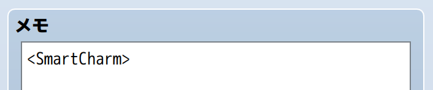

# HTN_SmartCharm

RPGツクールMZ用のプラグインです。

魅了された対象が、通常攻撃以外のスキルを使うなどの特徴を持つステート（状態異常）を作成できるようになります。

## 🛠️ 導入方法

**[【ここを右クリックして「名前を付けてリンク先を保存」みたいな項目を選んでダウンロード】](https://raw.githubusercontent.com/nekonenene/RPG-Maker-MZ-plugins/main/my_plugins/HTN_SmartCharm/HTN_SmartCharm.js)**

プラグインの導入方法については、[ツクール公式サイトの講座ページ](https://rpgmakerofficial.com/product/mz/plugin/start/dounyu.html)をご参考に！  
ダウンロードした `HTN_xxx.js` のような名前のファイルを、プロジェクト内の `js/plugins` フォルダーの中に入れてください。

## 🧭 使い方

「プラグイン管理」画面でこのプラグインを追加した後、  
ステートの「メモ」欄に `<SmartCharm>` というタグを記入することで、  
そのステートがこのプラグインの効果を持つようになります。

ステートの「行動制約」は、通常の魅了と同じく **「味方を攻撃」** にしておきましょう。

```
<SmartCharm>
```



## 🧩 機能詳細

ツクールMZのもともとの「魅了」と以下の点が異なります。

- **敵への回復優先**：「回復閾値(%)」で設定されたパーセンテージ以下のHPの敵がいる場合、HP回復スキルの使用を優先します
  - 魅了を付与してきた相手の回復を最優先
  - 魅了を付与してきた相手と同IDの敵キャラを次に優先
- **最高威力の攻撃選択**：通常攻撃・魔法・必殺技の中から最も威力の高い攻撃手段を選択
- HP回復スキル、魔法、必殺技の使用をそれぞれ禁止するオプションもあります
- **自分自身を狙う確率を設定可能**：「自傷確率(%)」を0にすれば、他の仲間を倒すまで自分を攻撃しなくなります
- 自分自身を攻撃するときの回避確率は０％に固定されています
- **行動不能状態**：「行動不能確率(%)」「行動不能時のメッセージ」が設定でき、相手に見とれているなどの表現が可能です
- **魅了付与ターンでの即行動**：ツクールMZの標準では、魅了付与がされたターンに自分の番が回ってきても行動しないようになっていますが、このプラグインで即行動も設定できるようになっています
- **回復ターンでの行動キャンセル**：ツクールMZの標準では、ダメージ等で魅了から回復したターンに自分の番が回ってきた場合、ランダムな相手への通常攻撃が発生していましたが、このプラグインでは行動しないように設定できます
- **継続メッセージの表示タイミング**：ステートの「この状態が継続しているとき」を設定した場合、ツクールMZの標準では、行動後に表示されるようになっています。つまり、攻撃後に「%1は魅了されている！」などのメッセージが出るため違和感があります。このプラグインでは、行動前に継続メッセージを表示するように設定できます

これらの機能のほとんどは、プラグインのパラメータで設定変更できるほか、  
ステートの「メモ」欄にタグを記入することで、個別に設定することもできます。

```
<SmartCharm>
<SmartCharm_AllowHeal: false>
<SmartCharm_AllowMagic: true>
<SmartCharm_AllowSpecial: true>
```

例えばこのように設定すると、魔法や必殺技を使用するけどHP回復はおこなわない魅了ステートになります。

設定の異なる２つの魅了ステータスを用いて、うなぎおおとろさん制作の「[StateUpdate](https://raw.githubusercontent.com/unagiootoro/RPGMZ/master/StateUpdate.js)」と組み合わせることで、  
軽度の魅了ステータスから重度の魅了ステータスへと変化していく表現も可能になることでしょう。

### タグ一覧

ステートの「メモ」欄に記述できるタグの一覧です。  
`<SmartCharm>` 以外のタグは、  
プラグインのパラメータで設定した値を上書きしない場合には記述しなくて大丈夫です。

- `<SmartCharm>`  
  このプラグインを有効化するために必要なタグ
- `<SmartCharm_HealThreshold: 数値>`  
  回復閾値(%)を上書き（例: `<SmartCharm_HealThreshold: 80>`）
- `<SmartCharm_SelfAttackRate: 数値>`  
  自傷確率(%)を上書き（例: `<SmartCharm_SelfAttackRate: 10>`）
- `<SmartCharm_AllowHeal: true/false>`  
  敵陣への回復スキルの使用可否を上書き
- `<SmartCharm_AllowMagic: true/false>`  
  魔法スキルの使用可否を上書き
- `<SmartCharm_AllowSpecial: true/false>`  
  必殺技スキルの使用可否を上書き
- `<SmartCharm_StunRate: 数値>`  
  行動不能確率(%)を上書き（例: `<SmartCharm_StunRate: 20>`）
- `<SmartCharm_StunMessage: テキスト>`  
  行動不能時に表示するメッセージを上書き（`%1` は行動者名に置換される。例: `<SmartCharm_StunMessage: %1はぼーっとしている。>`）
- `<SmartCharm_ActOnCharmTurn: true/false>`  
  魅了されたターンに手番が回ってきた場合に行動するかの設定を上書き
- `<SmartCharm_CancelActionOnRecover: true/false>`  
  魅了から回復したターンの行動をキャンセルするかの設定を上書き（`true`: 行動しない / `false`: ランダムな敵に攻撃）
- `<SmartCharm_ShowStateMessageBeforeAction: true/false>`  
  継続メッセージの表示タイミングを上書き（`true`: 行動前に表示 / `false`: 行動後に表示）

#### コピーしやすい用の一覧

```
<SmartCharm>
<SmartCharm_HealThreshold: 60>
<SmartCharm_SelfAttackRate: 0>
<SmartCharm_AllowHeal: true>
<SmartCharm_AllowMagic: true>
<SmartCharm_AllowSpecial: true>
<SmartCharm_StunRate: 0>
<SmartCharm_StunMessage: %1は相手に見とれている。>
<SmartCharm_ActOnCharmTurn: true>
<SmartCharm_CancelActionOnRecover: true>
<SmartCharm_ShowStateMessageBeforeAction: true>
```

## ⚠️ 注意点

ツクールMZの「魅了」は「混乱」の派生なので、混乱に関連するプラグインとの相性が悪い場合があります。

例えばトリアコンタンさん制作の「[ConfusionExtend](https://raw.githubusercontent.com/triacontane/RPGMakerMV/mz_master/ConfusionExtend.js)」は、混乱・魅了・激昂時の攻撃対象を制御する仕組みがあるので、  
このプラグインでの攻撃対象の選択処理と干渉する可能性があります。  
ステートIDごとに有効にするか設定する形式のプラグインですので、導入しただけで問題が起こる可能性は低いですが、  
`<SmartCharm>` が設定されたステートをステートIDに設定した場合は、おそらく変な挙動をするので注意が必要です。

pandaさん制作の「[PANDA_FixedConfusionAction](https://www.werepanda.jp/blog/20250724004955.html)」は、  
このプラグインで設定可能な「魅了されたターンの行動許可」「回復ターンの行動キャンセル」が常に true になる挙動を提供するものなので、  
併用する場合は、「魅了されたターンの行動許可」「回復ターンの行動キャンセル」を false に設定しても効果がないことにご注意ください。

## 📝 作者情報

ピンキーランド
**[X : @uwokido](https://x.com/uwokido)**  

バグ報告や要望などは [X](https://x.com/uwokido) にメンションでお寄せください。

## 📄 ライセンス

MIT License ( https://opensource.org/license/mit )
