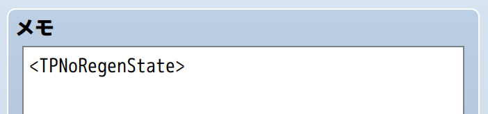

# HTN_TPNoRegenState

RPGツクールMZ用のプラグインです。

TPの回復ができなくなるステート（状態異常）を作成できるようになります。

## 🛠️ 導入方法

**[【ここを右クリックして「名前を付けてリンク先を保存」みたいな項目を選んでダウンロード】](https://raw.githubusercontent.com/nekonenene/RPG-Maker-MZ-plugins/main/my_plugins/HTN_TPNoRegenState/HTN_TPNoRegenState.js)**

プラグインの導入方法については、[ツクール公式サイトの講座ページ](https://rpgmakerofficial.com/product/mz/plugin/start/dounyu.html)をご参考に！  
ダウンロードした `HTN_xxx.js` のような名前のファイルを、プロジェクト内の `js/plugins` フォルダーの中に入れてください。

## 🧭 使い方

「プラグイン管理」画面でこのプラグインを追加した後、  
ステートの「メモ」欄に `<TPNoRegenState>` というタグを記入することで、  
そのステートがこのプラグインの効果を持つようになります。

```
<TPNoRegenState>
```



## 🧩 機能詳細

TPの回復には「ターン終了時の自動回復」「被ダメージ時」「アイテムやスキルによるTP回復」など、  
RPGツクールMZの戦闘では、いくつかのトリガーが存在します。  

この `<TPNoRegenState>` が設定された状態異常にかかるとTPが上昇しなくなりますが、  
「アイテムやスキルによるTP回復」は、**プラグインパラメータ**や、**ステートごとに設定できるタグ**で許可することもできます。

プラグインパラメータの設定値がデフォルトとなりますが、  
ステートの「メモ」欄にタグを記入することで、個別に設定することも可能です。  
`<TPNoRegenState>` 以外のタグは、必要なものだけ設定してください。

例えば、以下のように記述すると、スキルでのTP回復は有効な一方、  
アイテムでのTP回復ができず、アイテムでのTP回復時に「○○のやる気は上がらなかった！」という  
メッセージが表示されるようになります。

```
<TPNoRegenState>
<TPNoRegenState_ItemRecover: false>
<TPNoRegenState_SkillRecover: true>
<TPNoRegenState_RecoverBlockedMessage: %1のやる気は上がらなかった！>
```

少し特殊なケースですが、 `<TPNoRegenState>` が設定されたステートが複数用意されていて、  
それらのステートに同時にかかっている場合は、「優先度」がもっとも高いステートのタグが参照されるのでご注意ください。

なお、TPが回復しないことに加えてTPの減少もさせたい場合は、  
`<TPNoRegenState>` を設定したステートの「特徴」欄で、  
「能力値」＞「能力追加値」＞「TP再生率」として「-5%」などを設定することで実現できます！

これで、ターン終了ごとにTPが 5 ずつ減っていくようになります。

また、TPにダメージを与えるスキルを作れるプラグインとしては  
NUUNさんの「[TPDamageType](https://github.com/nuun888/MZ/blob/master/NUUN_TPDamageType.js)」があります。  
TPを0にした上で、このプラグインの状態異常でTPをしばらく回復できなくするようなスキルも作成できるかと思います。

### タグ一覧

ステートの「メモ」欄に記述できるタグの一覧です。  
`<TPNoRegenState>` 以外のタグは、  
プラグインのパラメータで設定した値を上書きしない場合には記述しなくて大丈夫です。

- `<TPNoRegenState>`  
  このプラグインを有効化するために必要なタグ
- `<TPNoRegenState_ItemRecover: true/false>`  
  アイテムによるTP回復の可否を上書き
- `<TPNoRegenState_SkillRecover: true/false>`  
  スキルによるTP回復の可否を上書き
- `<TPNoRegenState_RecoverBlockedMessage: テキスト>`  
  TP回復が無効化されたときの表示メッセージを上書き（文字列内の `%1` は対象者名、`%2` は「ＴＰ」の表示名に置換されます）

#### コピーしやすい用の一覧

```
<TPNoRegenState>
<TPNoRegenState_ItemRecover: false>
<TPNoRegenState_SkillRecover: false>
<TPNoRegenState_RecoverBlockedMessage: %1の%2を回復できない！>
```

## 📝 作者情報

ピンキーランド
**[X : @uwokido](https://x.com/uwokido)**  

バグ報告や要望などは [X](https://x.com/uwokido) にメンションでお寄せください。

## 📄 ライセンス

MIT License ( https://opensource.org/license/mit )
